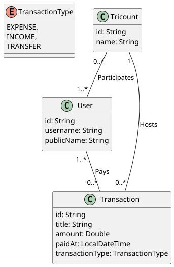

# Projet REST API - Tricount

Mettre en place la base d'une application similaire à Tricount (calcul de budgets entre amis :
partages et remboursements) en utilisant Spring Boot & une architecture MVC afin de permettre une
gestion des dépenses ainsi qu'une authentification optionnelle.

[Introducing Tricount](https://www.youtube.com/watch?v=rjDY84-CVks)

## Notes

Ce projet utilise la dépendence `Docker Compose` pour lancer un serveur `MySQL` dans un container
lorsqu'on démarre l'application, et nécessite que `Docker` soit lancé. Pour lancer ce projet sur un
serveur MySQL local, il suffit de commenter le contenu du fichier `compose.yaml`, ou supprimer la
dépendence `spring-boot-docker-compose` du fichier `pom.xml`.

## Objectifs

[Voir l'énoncé](https://gitlab.com/jeandemel-formations/hb-cda-2025/projets/projet-rest)

### Fonctionnalités attendues

- [x] Créer un groupe de dépenses
- [ ] Entrer des dépenses dans ce groupe (ex : Marc - Billet de train - 25€)
- [ ] Consulter la liste et le total des dépenses d'un groupe, filtrer par personne et montant
  (inférieur ou supérieur à...)
- [ ] Consulter le détail des dépenses, qui doit combien à qui, pouvoir indiquer qu'on a payé son dû
- [ ] S'authentifier pour voir les différents groupes auxquels on fait partis

### Étapes

- [x] Créer un diagramme d'entités
- [x] Initialiser le projet Spring Boot et les dépendances nécessaires
- [x] Mettre en place une architecture MVC (DTOs dans les controllers, la logique & l'accès aux
  repositories dans la couche Business)
- [ ] Quelques tests fonctionnels sur les endpoints

## Class Diagram

