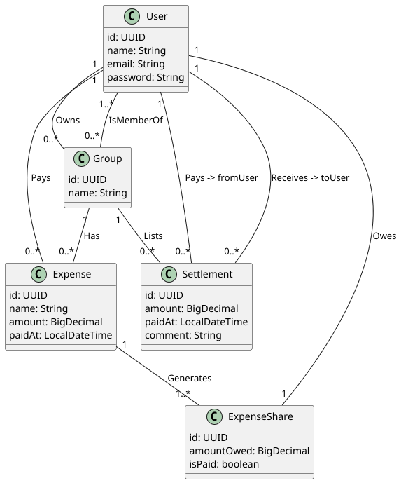

# Projet REST API - Tricount

Mettre en place la base d'une application similaire à Tricount (calcul de budgets entre amis :
partages et remboursements) en utilisant Spring Boot & une architecture MVC afin de permettre une
gestion des dépenses ainsi qu'une authentification optionnelle.

[Introducing Tricount](https://www.youtube.com/watch?v=rjDY84-CVks)

## Notes

Ce projet utilise la dépendence `Docker Compose` pour lancer un serveur `MySQL` dans un container
lorsqu'on démarre l'application, et nécessite que `Docker` soit lancé. Pour lancer ce projet sur un
serveur MySQL local, il suffit de commenter le contenu du fichier `compose.yaml`, ou supprimer la
dépendence `spring-boot-docker-compose` du fichier `pom.xml`.

### Lancer l'application

S'assurer que Docker Desktop soit ouvert (si vous conservez les fichiers mentionnés ci-dessus),
installer les dépendances :

```shell
  mvc clean install
```

Puis lancer le projet, ce qui lancera le serveur MySQL sur un container Docker en même temps :

```shell
  mvn spring-boot:run
```

La base de données sera remplie automatiquement lors du premier lancement grâce au `DataLoader`.
Elle peut également être remplie manuellement ou réinitialisée grâce à des requêtes présentes dans
les fichiers `.http`.

### Fichiers de requêtes HTTP

Variable: `base_url: http://localhost:8080/api/v1`

#### IntelliJ IDEA (HttpClient)

Ouvrir un des fichiers `.http` qui se trouvent dans le dossier `resources/http-requests` à
l'intérieur du chemin principal, appuyer sur le bouton `Run with:` dans le menu contextuel, puis
sélectionner `development`. Cela permettra aux fichiers `.http` de lire les variables contenues dans
le fichier `http-client.env.json`. Après cela, il suffira de lancer les requêtes depuis le fichier
en cliquant sur la flèche `run`.

#### VSCode

Pour VSCode, il faudra soit utiliser un outil comme Postman, ou une extension comme Bruno, et
adapter le contenu selon l'outil.

## Objectifs

[Voir l'énoncé](https://gitlab.com/jeandemel-formations/hb-cda-2025/projets/projet-rest)

### Fonctionnalités attendues

- [x] Créer un groupe de dépenses
- [x] Entrer des dépenses dans ce groupe (ex : Marc - Billet de train - 25€)
- [x] Consulter la liste et le total des dépenses d'un groupe, filtrer par personne et montant
  (inférieur ou supérieur à...)
- [x] Consulter le détail des dépenses, qui doit combien à qui
- [x] Pouvoir indiquer qu'on a payé son dû
- [x] S'authentifier pour voir les différents groupes auxquels on fait partis

### Étapes

- [x] Créer un diagramme d'entités
- [x] Initialiser le projet Spring Boot et les dépendances nécessaires
- [x] Mettre en place une architecture MVC (DTOs dans les controllers, la logique & l'accès aux
  repositories dans la couche Business)
- [x] Quelques tests fonctionnels sur les endpoints

## Class Diagram

